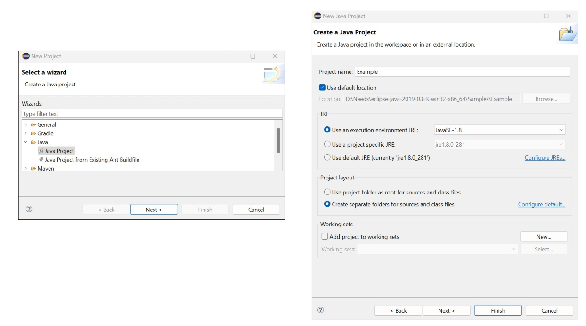
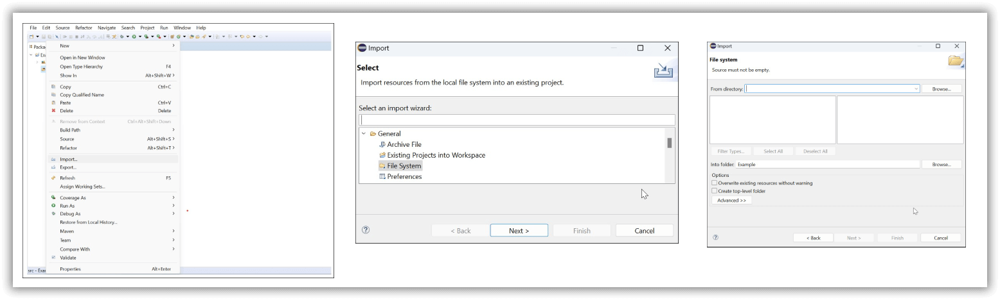
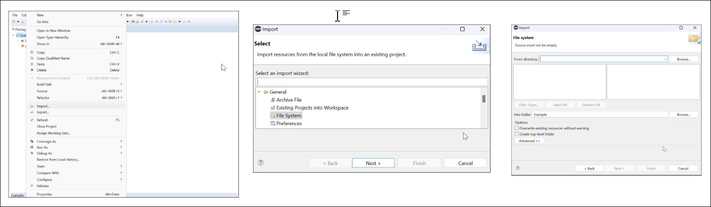
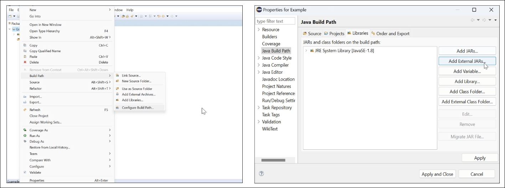

## Syncfusion Java Word Library

The Syncfusion DocIO is a [Java Word library](https://www.syncfusion.com/document-processing/word-framework/java/word-library?utm_source=github&utm_medium=listing&utm_campaign=github-docio-examples) allows you to add advanced Word document processing and does not require Microsoft Word application to be installed in the machine. It is a non-UI component that provides a full-fledged document instance model similar to the Microsoft Office COM libraries to iterate with the document elements explicitly and perform necessary manipulation. 

Take a moment to peruse the [documentation](https://help.syncfusion.com/java-file-formats/word-library/getting-started?utm_source=github&utm_medium=listing&utm_campaign=github-docio-examples), where you can find basic Word document processing options along with the features like [mail merge](https://help.syncfusion.com/java-file-formats/word-library/working-with-mail-merge?utm_source=github&utm_medium=listing&utm_campaign=github-docio-examples), [merge](https://help.syncfusion.com/java-file-formats/word-library/working-with-word-document?utm_source=github&utm_medium=listing&utm_campaign=github-docio-examples#merging-word-documents), [find and replace](https://help.syncfusion.com/java-file-formats/word-library/working-with-find-and-replace?utm_source=github&utm_medium=listing&utm_campaign=github-docio-examples) text in the Word document, [protect](https://help.syncfusion.com/java-file-formats/word-library/working-with-security?utm_source=github&utm_medium=listing&utm_campaign=github-docio-examples) the Word documents and most importantly, [RTF](https://help.syncfusion.com/java-file-formats/word-library/rtf?utm_source=github&utm_medium=listing&utm_campaign=github-docio-examples), [Text](https://help.syncfusion.com/java-file-formats/word-library/text?utm_source=github&utm_medium=listing&utm_campaign=github-docio-examples), and  [HTML](https://help.syncfusion.com/java-file-formats/word-library/html?utm_source=github&utm_medium=listing&utm_campaign=github-docio-examples) conversions with code examples.

## Key Features

*   Support to [create Word document](https://help.syncfusion.com/java-file-formats/word-library/getting-started?utm_source=github&utm_medium=listing&utm_campaign=github-docio-examples) from scratch.
*   Support to open, modify and save the existing Word documents.
*   Advanced [Mail merge](https://help.syncfusion.com/java-file-formats/word-library/working-with-mail-merge?utm_source=github&utm_medium=listing&utm_campaign=github-docio-examples) support with different data sources.
*   Ability to create or edit Word 2007 and later version documents (DOCX), and convert them to commonly used file formats such as [WordML](https://help.syncfusion.com/java-file-formats/word-library/word-file-formats?utm_source=github&utm_medium=listing&utm_campaign=github-docio-examples#word-processing-xml-xml), [TXT](https://help.syncfusion.com/java-file-formats/word-library/text?utm_source=github&utm_medium=listing&utm_campaign=github-docio-examples), [HTML](https://help.syncfusion.com/java-file-formats/word-library/html?utm_source=github&utm_medium=listing&utm_campaign=github-docio-examples) and vice versa.
*   Ability to create and manipulate  [Shapes](https://help.syncfusion.com/java-file-formats/word-library/working-with-shapes?utm_source=github&utm_medium=listing&utm_campaign=github-docio-examples), and [Group shape](https://help.syncfusion.com/java-file-formats/word-library/working-with-shapes?utm_source=github&utm_medium=listing&utm_campaign=github-docio-examples#grouping-shapes) in DOCX and WordML format documents.
*   Ability to read and write [Built-In and Custom Document Properties](https://help.syncfusion.com/java-file-formats/word-library/working-with-word-document?utm_source=github&utm_medium=listing&utm_campaign=github-docio-examples#working-with-word-document-properties).
*   Support to insert and edit the [form fields](https://help.syncfusion.com/java-file-formats/word-library/working-with-form-fields?utm_source=github&utm_medium=listing&utm_campaign=github-docio-examples).
*   Ability to insert [Bookmarks](https://help.syncfusion.com/java-file-formats/word-library/working-with-bookmarks?utm_source=github&utm_medium=listing&utm_campaign=github-docio-examples) and navigate corresponding bookmarks to insert, replace, and delete content.

## Compatible Microsoft Word Versions

*   Microsoft Word 2007
*   Microsoft Word 2010
*   Microsoft Word 2013
*   Microsoft Word 2016
*   Microsoft Word 2019
*   Microsoft 365

## Supported File Formats

*   Creates, reads, and edits popular text file formats like [DOCX](https://help.syncfusion.com/java-file-formats/word-library/word-file-formats?utm_source=github&utm_medium=listing&utm_campaign=github-docio-examples#word-open-xml-formats-2007--later), [DOTX](https://help.syncfusion.com/java-file-formats/word-library/word-file-formats?utm_source=github&utm_medium=listing&utm_campaign=github-docio-examples#templates), DOTM, [DOCM](https://help.syncfusion.com/java-file-formats/word-library/word-file-formats?utm_source=github&utm_medium=listing&utm_campaign=github-docio-examples#macros), [WordML](), [RTF](https://help.syncfusion.com/java-file-formats/word-library/rtf?utm_source=github&utm_medium=listing&utm_campaign=github-docio-examples), [Text](https://help.syncfusion.com/java-file-formats/word-library/text?utm_source=github&utm_medium=listing&utm_campaign=github-docio-examples), [HTML](https://help.syncfusion.com/java-file-formats/word-library/html?utm_source=github&utm_medium=listing&utm_campaign=github-docio-examples).
*   Converts Word documents also to [RTF](https://help.syncfusion.com/java-file-formats/word-library/rtf?utm_source=github&utm_medium=listing&utm_campaign=github-docio-examples), [Text](https://help.syncfusion.com/java-file-formats/word-library/text?utm_source=github&utm_medium=listing&utm_campaign=github-docio-examples), and  [HTML](https://help.syncfusion.com/java-file-formats/word-library/html?utm_source=github&utm_medium=listing&utm_campaign=github-docio-examples).

## How to run the examples

### How to run in Command Prompt

-	Clone this repository.
-	Open the command prompt and navigate to the samples root directory.
-	Set the Java path using below command

*Syntax:* `set path=<jdk_installed_location>` 

*Example:* `set path=C:\Program Files\Java\jdk-12.0.1\bin`

-	Compile the sample with the dependent jars file using below command

*Syntax:* `javac -cp “<jar_file1_location>;.;”<jar_file2_location>” sampleFolder/*.java`

*Example:* `javac -cp "D:\Jars\syncfusion-docio-21.2.10.jar";.;"D:\Jars\syncfusion-javahelper-21.2.10.jar";.;"D:\Jars\syncfusion-licensing-21.2.10.jar" examples\helloworld\HelloWorld.java`

-	Run the sample using below command

*Syntax:* `java -cp “<jar_file1_location>;.;”<jar_file2_location>” sampleFolder.JavaFile` 

*Example:* `java -cp "D:\Jars\syncfusion-docio-21.2.10.jar";.;"D:\Jars\syncfusion-javahelper-21.2.10.jar";.;"D:\Jars\syncfusion-licensing-21.2.10.jar" examples.helloworld.HelloWorld`

### How to run in Eclipse

- Open Eclipse IDE
- Create a new Java Project.

 
 

- Select the src and import code examples folder 

 
 

- Select the project and import the resources folder

 
 

- Add the respective jars 

 
 

- Run the application

## Resources

- **Product page:** [Syncfusion Java Word Framework](https://www.syncfusion.com/document-processing/word-framework/java?utm_source=github&utm_medium=listing&utm_campaign=github-docio-examples)
- **Documentation:** [Syncfusion Java Word library](https://help.syncfusion.com/java-file-formats/word-library/overview?utm_source=github&utm_medium=listing&utm_campaign=github-docio-examples)
-   **Knowledge Base:** [Syncfusion Word library - Knowledge Base](https://www.syncfusion.com/kb/java/docio?utm_source=github&utm_medium=listing&utm_campaign=github-docio-examples)

## Support and feedback

For any other queries, reach our [Syncfusion support team](https://support.syncfusion.com/?utm_source=github&utm_medium=listing&utm_campaign=github-docio-examples) or post the queries through the [community forums](https://www.syncfusion.com/forums?utm_source=github&utm_medium=listing&utm_campaign=github-docio-examples).

Request new feature through [Syncfusion feedback portal](https://www.syncfusion.com/feedback?utm_source=github&utm_medium=listing&utm_campaign=github-docio-examples).

## License

This is a commercial product and requires a paid license for possession or use. Syncfusion's licensed software, including this component, is subject to the terms and conditions of [Syncfusion's EULA](https://www.syncfusion.com/license/studio/22.2.5/syncfusion_essential_studio_eula.pdf?utm_source=github&utm_medium=listing&utm_campaign=github-docio-examples). You can purchase a licnense [here](https://www.syncfusion.com/sales/products?utm_source=github&utm_medium=listing&utm_campaign=github-docio-examples) or start a free 30-day trial [here](https://www.syncfusion.com/account/manage-trials/start-trials?utm_source=github&utm_medium=listing&utm_campaign=github-docio-examples).

## About Syncfusion

Founded in 2001 and headquartered in Research Triangle Park, N.C., Syncfusion has more than 29,000 customers and more than 1 million users, including large financial institutions, Fortune 500 companies, and global IT consultancies.

Today, we provide 1700+ components and frameworks for web ([Blazor](https://www.syncfusion.com/blazor-components?utm_source=github&utm_medium=listing&utm_campaign=github-docio-examples), [ASP.NET Core](https://www.syncfusion.com/aspnet-core-ui-controls?utm_source=github&utm_medium=listing&utm_campaign=github-docio-examples), [ASP.NET MVC](https://www.syncfusion.com/aspnet-mvc-ui-controls?utm_source=github&utm_medium=listing&utm_campaign=github-docio-examples), [ASP.NET WebForms](https://www.syncfusion.com/jquery/aspnet-webforms-ui-controls?utm_source=github&utm_medium=listing&utm_campaign=github-docio-examples), [JavaScript](https://www.syncfusion.com/javascript-ui-controls?utm_source=github&utm_medium=listing&utm_campaign=github-docio-examples), [Angular](https://www.syncfusion.com/angular-ui-components?utm_source=github&utm_medium=listing&utm_campaign=github-docio-examples), [React](https://www.syncfusion.com/react-ui-components?utm_source=github&utm_medium=listing&utm_campaign=github-docio-examples), [Vue](https://www.syncfusion.com/vue-ui-components?utm_source=github&utm_medium=listing&utm_campaign=github-docio-examples), and [Flutter](https://www.syncfusion.com/flutter-widgets?utm_source=github&utm_medium=listing&utm_campaign=github-docio-examples)), mobile ([Xamarin](https://www.syncfusion.com/xamarin-ui-controls?utm_source=github&utm_medium=listing&utm_campaign=github-docio-examples), [Flutter](https://www.syncfusion.com/flutter-widgets?utm_source=github&utm_medium=listing&utm_campaign=github-docio-examples), [UWP](https://www.syncfusion.com/uwp-ui-controls?utm_source=github&utm_medium=listing&utm_campaign=github-docio-examples), and [JavaScript](https://www.syncfusion.com/javascript-ui-controls?utm_source=github&utm_medium=listing&utm_campaign=github-docio-examples), [.NET MAUI](https://www.syncfusion.com/maui-controls?utm_source=github&utm_medium=listing&utm_campaign=github-docio-examples)) and desktop development ([WinForms](https://www.syncfusion.com/winforms-ui-controls?utm_source=github&utm_medium=listing&utm_campaign=github-docio-examples), [WPF](https://www.syncfusion.com/wpf-ui-controls?utm_source=github&utm_medium=listing&utm_campaign=github-docio-examples), [WinUI](https://www.syncfusion.com/winui-controls?utm_source=github&utm_medium=listing&utm_campaign=github-docio-examples), [Flutter](https://www.syncfusion.com/flutter-widgets?utm_source=github&utm_medium=listing&utm_campaign=github-docio-examples), [UWP](https://www.syncfusion.com/uwp-ui-controls?utm_source=github&utm_medium=listing&utm_campaign=github-docio-examples), and [.NET MAUI](https://www.syncfusion.com/maui-controls?utm_source=github&utm_medium=listing&utm_campaign=github-docio-examples)) a. We provide ready-to-deploy enterprise software for dashboards, reports, data integration, and big data processing. Many customers have saved millions in licensing fees by deploying our software.
